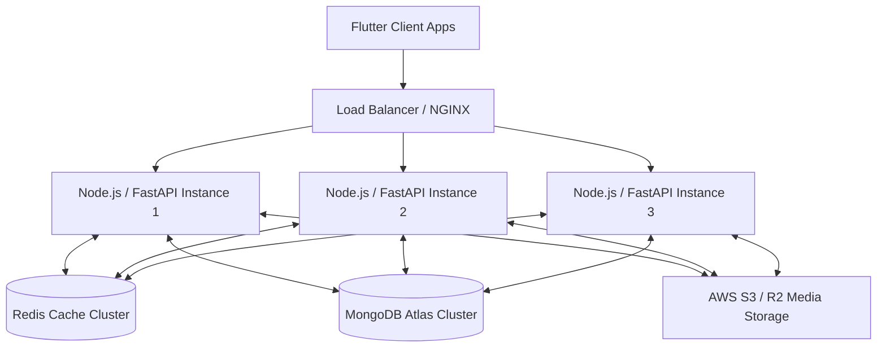

# 🌟 AAKAA MENTAL HEALTH PLATFORM
## Master System Architecture & Development Roadmap

This master document serves as the long-term architectural blueprint and step-by-step development roadmap for the **Aakaa Mental Health Platform**. It is designed to guide engineering teams from our beautifully polished frontend baseline to an enterprise-grade production launch capable of handling **35,000+ concurrent users**.

---

## 🏛️ PART 1: Current State & Frontend Inventory

We have successfully established a flawless, 100% zero-warning Flutter codebase (`flutter analyze` = 0 issues).

### 1. Design System: "Calming Daylight"
* **Palette**: Soft `#FFF7F5` base, deep emerald `#065643` brand accents, and clean white elevated cards.
* **Aesthetics**: Glassmorphic floating containers, smooth micro-animations (`ZenBackground`), and modern Google Fonts (`Outfit`).

### 2. Centralized Reactive State Engine
The app operates on lightweight static `ValueNotifier` singletons in memory, ensuring instant UI reactivity across tabs without requiring page reloads:
* `UserController`: Manages user credentials, emails, and full names.
* `PlanController`: Manages the active 4-tier subscription status and unlocks premium features instantly.
* `ActivityController`: Tracks daily mood scores, selected emotion tags, and journal entries.
* `SessionController`: Manages booked tele-therapy appointments and consultation rooms.
* `NotificationController`: Dispatches automated real-time alerts across milestones and upgrades.

### 3. Consultation UI Suite
* **Discovery**: `findtherapist.dart`, `therapist_detail_screen.dart`
* **Scheduling & Payment**: `booking_screen.dart`, `payment_screen.dart`, `payment_success_screen.dart`
* **Consultation Rooms**: `session_hub.dart`, `video_call_screen.dart`, `audio_call_screen.dart`, `chat_screen.dart`, `message_hub.dart`

---

## 🏗️ PART 2: Production System Architecture (Handling 35k+ Users)

To scale effortlessly beyond 35,000 concurrent clients, guarantee zero downtime, and eliminate server crashes, Aakaa uses a containerized, decoupled backend architecture:

### 1. Core API Servers & Containerization
* **Technology**: Node.js (Express/NestJS) or Python (FastAPI).
* **Scaling**: Packaged in Docker containers running on Kubernetes or Google Cloud Run. The Load Balancer automatically spins up new instances when user traffic spikes at peak morning/evening hours.

### 2. Ultra-Fast Caching Layer (Redis)
* **Purpose**: Storing read-only content (Therapist profiles, Daily Affirmations, Disorder Guides) and active user session tokens.
* **Benefit**: Relieves the primary database from 80% of read traffic, delivering sub-millisecond response times.

### 3. Database Persistence & Media Storage
* **Structured Data**: **MongoDB Atlas** (Cluster storage of ~5GB is easily sufficient for 35k active users across accounts, mood logs, bookings, and text messages).
* **Media Storage**: **AWS S3** or **Cloudflare R2**. Profile avatars, voice notes, and clinical PDF reports are stored in object buckets. MongoDB only stores the lightweight 50-byte text URL.

### 4. Real-Time Tele-Therapy Signaling
* Isolated WebSockets or dedicated WebRTC backbones (**Agora** or **Twilio SDK**) handle low-latency video, audio, and secure direct doctor messaging without overloading core API servers.

---

## 💎 PART 3: 4-Tier Monetization Model

Our refined subscription model is designed to drive viral daily retention through a generous free tier, while offering life-changing clinical care in our premium tiers:

| Tier & Pricing | Core Value Proposition | Key Included Features | Locked / Excluded Features |
| :--- | :--- | :--- | :--- |
| 🧪 **Freemium** *(Free Forever)* | The Daily Habit Engine | • Basic profile setup • Affirmations & breathing timer • 7-day mood history • Full therapist directory | • Advanced sleep sanctuaries • AI journal analysis • Direct doctor text messaging • Downloadable PDF reports |
| 🎯 **Basic** *(₹399 / month)* | Self-Help Mastery | • Unlimited mood & sleep history • Full sleep audio sanctuaries • 5 AI journal analyses / month • Priority customer support | • Unlimited AI clinical coach • Direct doctor text messaging • Downloadable PDF reports • Free monthly live check-ins |
| ⭐ **Standard** *(₹899 / month)* | Guided Care | • Unlimited AI clinical coach • Direct doctor text messaging • Monthly certified PDF reports • 10% off live video sessions | • Dedicated matched therapist • Priority 3h doctor response • Free monthly live check-ins |
| 💎 **Premium** *(₹1,799 / month)* | Complete VIP Clinical Care | • Dedicated matched therapist • Priority 3h doctor response • Weekly certified reports • 1 Free 30-min live check-in / mo • Emergency grounding audio line | *None — Complete VIP access* |

---

## 🚀 PART 4: Phase-by-Phase Execution Roadmap (Starting Tomorrow)

This checklist provides precisely structured, bite-sized tasks so you can start executing the backend integration smoothly tomorrow morning:

### 📅 PHASE 1 (Tomorrow): Custom Backend Initialization & MongoDB Schema
- [ ] Create backend directory (`aakaa-backend`).
- [ ] Initialize Node.js + Express project (`npm init -y`) and install dependencies (`express`, `mongoose`, `dotenv`, `cors`).
- [ ] Define Mongoose BSON Schemas for:
  - [ ] `User`: UID, email, hashed password, full name, active subscription tier, streak count, created date.
  - [ ] `ActivityLog`: Client ID, mood score (1-5), emotion tags, journal text snippet, timestamp.
  - [ ] `SessionBooking`: Client ID, Therapist ID, appointment date, consultation type, payment status.
  - [ ] `ChatMessage`: Sender ID, Recipient ID, message text, read status, timestamp.
- [ ] Set up connection to MongoDB Atlas cluster in `server.js`.

### 🔒 PHASE 2: Real Authentication & Profile Persistence
- [ ] Build backend routes for `/api/auth/register`, `/api/auth/login`, and `/api/auth/verify-otp` (using `bcrypt` and JWT tokens).
- [ ] Connect Flutter client's `SignupLoginFunctionality` to make real HTTP POST requests to your new backend routes.
- [ ] Build `/api/users/profile` endpoints to fetch and update user settings and active subscription plans upon login.

### 💳 PHASE 3: Payment Gateway Integration (Razorpay / Stripe)
- [ ] Register for a Razorpay or Stripe merchant account.
- [ ] Build backend endpoint `/api/payments/create-order` to generate secure transaction IDs.
- [ ] Integrate official Flutter Razorpay/Stripe SDK into `payment_screen.dart` to replace the simulation with live UPI/Card processing.
- [ ] Build webhook handler to instantly update `PlanController` and MongoDB user documents when a payment succeeds.

### 📞 PHASE 4: Real Tele-Therapy Signaling (Agora WebRTC)
- [ ] Register for Agora developer credentials (App ID & App Certificate).
- [ ] Build backend endpoint `/api/agora/generate-token` to securely generate RTC tokens for booked appointments.
- [ ] Connect Agora Flutter SDK inside `video_call_screen.dart` and `audio_call_screen.dart` for real peer-to-peer streaming.

### 🤖 PHASE 5: AI Clinical Coach Integration
- [ ] Obtain Gemini or Claude API credentials.
- [ ] Build backend endpoint `/api/ai/analyze-journal`. When Premium users log a journal entry, the backend sends the text to the LLM with a strict clinical system prompt to identify cognitive distortions and return CBT exercises.
- [ ] Render the AI diagnostic response beautifully in the Flutter journal details screen.

### 📄 PHASE 6: Certified Progress PDF Generator & Audio Sanctuaries
- [ ] Implement PDF generator in backend (e.g., using `puppeteer` or `pdfkit`) to generate monthly mood charts and session summaries.
- [ ] Build endpoint `/api/reports/download-monthly-report` for Standard and Premium users.
- [ ] Integrate `just_audio` package into Flutter to stream sleep soundscape MP3s hosted securely on AWS S3.

### 🩺 PHASE 7: Therapist Portal Completion & Production CI/CD
- [ ] Connect the Doctor's Companion App (`therapists_ui`) to the backend so doctors can manage availability calendars and approve appointments.
- [ ] Configure Docker containerization and set up Blue-Green deployment pipeline to Google Cloud Run or AWS ECS.
- [ ] Conduct load testing (using tools like Locust or Artillery) to simulate 35,000 concurrent user requests and verify Redis caching efficiency.
