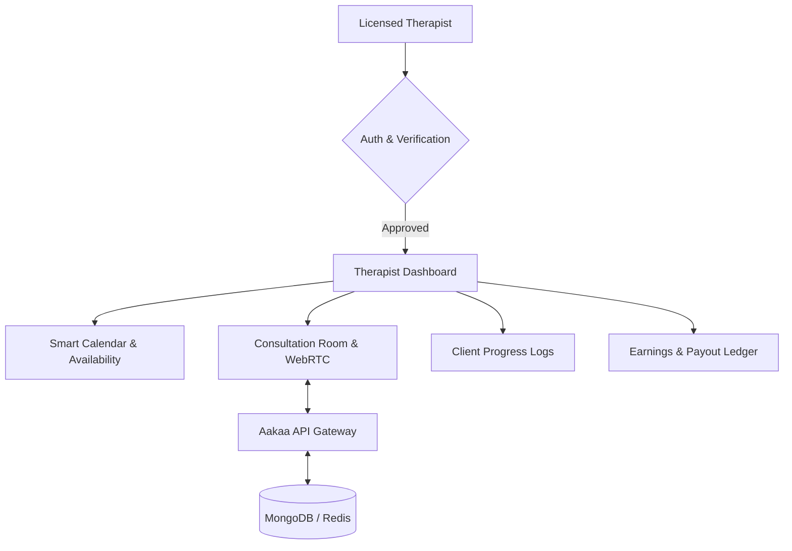

# 🩺 AAKAA THERAPIST APP (DOCTOR'S COMPANION)
## 📋 Master Development Roadmap & Feature Specifications

This document serves as the official architectural blueprint and product roadmap for the **Aakaa Therapist App** (`therapists_ui`). Currently, this sub-project contains initial layouts. This roadmap lays out the comprehensive path to transform it into a professional, secure portal for licensed therapists, psychologists, and counselors to manage their schedules, run high-definition tele-therapy calls, review shared clinical histories, and monitor their monthly earnings.

---

## 🏛️ PART 1: The Core Philosophy & Architecture

The Therapist App is designed to operate on a completely different workflow than the Client application. While the client app prioritizes self-healing and seeking care, the therapist app focuses on **clinical efficiency, session security, calendar management, and financial transparency**.



---

## 🚀 PHASE 1: Professional Authentication & Verification Flow

To build high clinical trust and satisfy medical-grade security, we must establish a robust professional registration and credential verification system.

### 1. Document & Verification Board
- **License Upload Center**: Secure upload portal for State Medical Licenses, practice certifications, and university degrees (stored as encrypted PDFs on AWS S3/R2).
- **Admin Review State**: A beautiful, calm "Waiting Room" screen when a newly registered therapist logs in. It displays verification status (`Pending Verification`, `Action Required`, or `Approved`) with clear instructions.
- **Onboarding Form**: Setup of specialized therapeutic tags (e.g., CBT, ADHD, Clinical Anxiety, Trauma, Grief Support, Couples Counseling, Child Psychology).

### 2. Profile Customization Dashboard
- **Consultation Rates**: Set per-minute or per-session fees for three main channels:
  - 💬 **Direct Messaging** (Chat-based support).
  - 📞 **Audio Consultation** (Voice-only therapy).
  - 🎥 **Video Consultation** (Face-to-face tele-therapy).
- **Bio & Video Intro**: Upload personal description, credentials, languages spoken, and a 30-second introductory video for clients to view.

---

## 📅 PHASE 2: Interactive Smart Calendar & Availability Engine

Therapists need precise control over their working hours to avoid double bookings and burnouts.

### 1. The Availability Matrix
- **Recurring Slots Creator**: An interactive, custom calendar grid UI. Doctors can set recurring weekly working blocks (e.g., Mondays & Wednesdays: `10:00 AM - 1:00 PM` and `3:00 PM - 7:00 PM`).
- **Emergency "Instant Block"**: A prominent global toggle allowing therapists to mark themselves offline or block specific days immediately.
- **Duration Tuning**: Set custom session durations (e.g., 30 minutes, 45 minutes, or 60 minutes) with automatic 10-minute buffer spacing between bookings.

### 2. Smart Booking Inbox
- **Request Approval Panel**: Real-time push notification system when a client requests a booking.
- **Action Suite**:
  - **Approve**: Lock session instantly, dispatch confirmation notification to the client, and schedule automatic reminders.
  - **Suggest Reschedule**: Opens an inline message board suggesting alternative times from the availability matrix.
  - **Decline**: Decline with standard professional templates (e.g., "Out of specialty scope", "At maximum capacity") to protect patient sensitivity.

---

## 💬 PHASE 3: Secure Tele-Therapy & Clinical Consultation Suite

This is the core operational room where therapy takes place. Security, absolute zero-latency media, and smart clinical notes are critical.

### 1. High-Definition Consultation Rooms
- **Agora WebRTC Integration**: Mirroring the client's peer-to-peer audio/video streaming engine but enhanced with specific therapist controls:
  - **Clinical Pause**: Temporarily turn off the doctor's camera/microphone with a professional placeholder ("Doctor is taking notes").
  - **Session Timer HUD**: Clear countdown display showing remaining minutes with soft, non-intrusive warnings at 10 minutes and 5 minutes remaining.
  - **Secure Chat Bridge**: Synchronous in-session chat with immediate text locking once the session concludes.

### 2. The Clinical Note-Taking Suite
- **Side-by-Side Split View**: On desktop/tablets, an inline markdown text editor alongside the video call to take real-time clinical notes.
- **Encrypted Clinical Notepad**: Custom encryption (AES-256) on notes before they are sent to the backend. These are strictly confidential and *never* visible to clients.
- **CBT Diagnostic Viewer**: If the client is on a Standard/Premium tier and has allowed sharing, the therapist can read:
  - Client's past 30 days of daily mood scores & emotion tags.
  - Client's AI CBT journal analysis history to prepare clinical approaches before the call starts.

---

## 📊 PHASE 4: Earnings Dashboard & Financial Ledger

A beautiful, transparent system to track incoming payments, completed appointments, and platform payouts.

### 1. Interactive Financial Hub
- **Earnings Analytics**: Dynamic, custom-drawn charts showing weekly, monthly, and yearly income.
- **Performance Breakdown**: View revenue split by Consultation Type (Video vs. Audio vs. Chat) and Client Tier.
- **Payout Progress Bar**: Clear progress indicators showing when the completed session earnings will settle into their bank account (e.g., `Settled`, `Processing`, `Pending Payout`).

### 2. Therapist Rating & Review Board
- **Professional Feedback Summary**: Displays aggregate rating scores (e.g., 4.8/5) and a list of client written feedback (anonymized to protect client privacy).
- **Client Growth Statistics**: Track number of repeat clients, active streaks, and session completion rate.

---

## 🧪 PHASE 5: Backend API Integration & Database Schemas

We will synchronize the front-end elements of `therapists_ui` with the Node.js/MongoDB backend by introducing specific server routes and schemas.

### 1. MongoDB Therapist Document Schema (`TherapistSchema`)
```javascript
const TherapistSchema = new mongoose.Schema({
  userId: { type: mongoose.Schema.Types.ObjectId, ref: 'User', required: true },
  licenseNumber: { type: String, required: true },
  specialties: [{ type: String }],
  verificationStatus: { type: String, enum: ['pending', 'approved', 'rejected'], default: 'pending' },
  availability: [
    {
      dayOfWeek: { type: Number, min: 0, max: 6 }, // 0 = Sunday
      slots: [{ start: String, end: String }]      // e.g. "09:00" to "12:00"
    }
  ],
  pricing: {
    chat: { type: Number, default: 0 },
    audio: { type: Number, default: 0 },
    video: { type: Number, default: 0 }
  },
  ratings: {
    average: { type: Number, default: 5.0 },
    count: { type: Number, default: 0 }
  },
  earningsPending: { type: Number, default: 0 },
  earningsSettled: { type: Number, default: 0 }
});
```

### 2. Core API Endpoints
- `POST /api/therapist/register` - Create therapist profile & upload license credentials.
- `GET /api/therapist/profile` - Fetch details for the logged-in doctor.
- `PUT /api/therapist/availability` - Update calendar availability matrix.
- `POST /api/therapist/bookings/action` - Accept, reschedule, or decline a client booking.
- `GET /api/therapist/sessions` - Retrieve historical and upcoming booked sessions.
- `POST /api/therapist/sessions/notes` - Add secure encrypted session notes.
- `GET /api/therapist/earnings` - Fetch monthly financial analytics.
